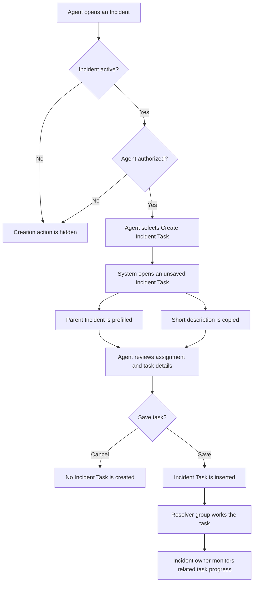

# Incident Task Creation from the Incident Form

**Feature status:** Implemented, deployed, rolled back, reapplied, and validated on
`dev312411`

**Target users:** Service desk agents, incident coordinators, and resolver groups  
**Primary table:** `incident`  
**Created record:** `incident_task`

## 1. Executive summary

Incident Task records let an incident coordinator divide incident resolution into
smaller, independently assignable pieces of work while retaining one Incident as the
business-facing record.

Service Operations Workspace already provides a **Create Incident Task** action. The
classic Incident form does not expose an equivalent action, which forces classic-UI
agents to navigate to the Incident Task table and manually relate a new task to the
Incident.

This feature adds **Create Incident Task** to active classic Incident forms. Selecting
the action opens a proposed, unsaved Incident Task with the parent Incident and short
description prefilled. The agent reviews and completes the task before saving it. The
feature deliberately does not create a task immediately.

## 2. Business problem

During incident resolution, several teams may need to perform work in parallel. A
coordinator may need a network team to investigate connectivity, an application team to
review logs, and a database team to verify capacity. Recording all work only in the
Incident activity stream makes ownership and progress difficult to manage.

Incident Tasks solve this by giving each work item:

- its own number, state, assignment group, assignee, description, and work notes;
- a direct relationship to the parent Incident;
- independent ownership while the Incident remains the coordination record; and
- standard Task security, auditing, notifications, and reporting.

The classic UI currently adds unnecessary navigation and increases the risk that a task
is created without the correct Incident relationship.

## 3. Goals and non-goals

### Goals

- Let an authorized agent start Incident Task creation directly from an active Incident.
- Preserve the existing Service Operations Workspace behavior.
- Show the proposed Incident Task before any record is inserted.
- Prefill the parent Incident and short description to reduce re-entry and mistakes.
- Continue to enforce the platform's existing Incident Task ACLs and business rules.
- Provide an automated acceptance workflow with screenshots and a Playwright trace.

### Non-goals

- Automatically create a fixed set of tasks from a template.
- Automatically assign the new task to a group or user.
- Change Incident or Incident Task state models.
- Change Incident Task ACLs, notifications, SLAs, or closure rules.
- Replace the existing Service Operations Workspace action.
- Allow task creation from inactive Incidents.

## 4. Actors and responsibilities

| Actor | Responsibility |
|---|---|
| Incident coordinator | Decides that separate work is required and creates the Incident Task. |
| Resolver group | Owns and completes the assigned Incident Task. |
| Incident owner | Monitors task progress and coordinates overall Incident resolution. |
| Platform administrator | Deploys the UI action and maintains role/plugin configuration. |
| Automated acceptance recipe | Verifies that the action is visible, proposes the correct task, and can save it. |

## 5. Current-state workflow

### Service Operations Workspace

1. The agent opens an active Incident.
2. The agent selects **Create Incident Task**.
3. Workspace opens a new, unsaved Incident Task.
4. The `incident` field is prefilled with the current Incident.
5. The agent reviews and saves or cancels the task.

### Classic Incident form

1. The agent opens an active Incident.
2. No equivalent **Create Incident Task** action is available.
3. The agent must navigate to Incident Tasks and select **New**.
4. The agent must find and select the parent Incident manually.
5. The agent completes and saves the task.

This creates an inconsistent user experience and introduces avoidable data-entry risk.

## 6. Target-state workflow



### End-user procedure

1. Open the Incident that requires a separate work item.
2. Confirm that the Incident is active.
3. Select **Create Incident Task** from the form header or form context menu.
4. Review the proposed Incident Task:
   - confirm the **Incident** field points to the correct parent;
   - refine the **Short description**;
   - select an **Assignment group** and, when appropriate, an **Assigned to** user;
   - add sufficient **Description** or **Work notes** for the resolver;
   - set any other required task fields.
5. Select **Submit** or **Save** to create the task.
6. If the task is not required, navigate back or cancel; no record has been created yet.
7. Monitor the task from the Incident's related records and activity.

## 7. Functional requirements

### FR-001 — Action availability

The classic Incident form must show **Create Incident Task** only when:

- the Incident is active; and
- the user has the `itil` role, or the incident-management roles plugin is active and
  the user has `sn_incident_write`.

### FR-002 — No immediate insert

Selecting the action must not insert an Incident Task. It must open a new unsaved record
so the agent can review or cancel it.

### FR-003 — Parent relationship

The proposed Incident Task's `incident` reference must equal the source Incident's
`sys_id`.

### FR-004 — Description prefill

The proposed Incident Task's `short_description` must initially match the source
Incident's short description. The agent may change it before saving.

### FR-005 — Return navigation

After task creation or cancellation, the source Incident must remain the logical return
record.

### FR-006 — Existing controls remain authoritative

The feature must not bypass Incident Task create ACLs, field ACLs, mandatory fields,
data policies, or business rules.

### FR-007 — Workspace compatibility

The existing Service Operations Workspace action must remain unchanged. The new action
must be classic-compatible and must not be formatted for Configurable Workspace.

## 8. User scenarios and acceptance criteria

### Scenario 1 — Create a task from an active Incident

**Given** an authorized agent is viewing an active Incident in classic UI  
**When** the agent selects **Create Incident Task**  
**Then** an unsaved Incident Task opens  
**And** the Incident reference identifies the source Incident  
**And** the short description is copied from the Incident  
**And** no task exists until the agent saves.

### Scenario 2 — Review and cancel

**Given** the proposed Incident Task is open  
**When** the agent navigates back without saving  
**Then** no Incident Task is inserted  
**And** the Incident remains unchanged.

### Scenario 3 — Save the proposed task

**Given** the proposed task has valid required values  
**When** the agent saves it  
**Then** ServiceNow assigns an Incident Task number and `sys_id`  
**And** the task remains related to the source Incident  
**And** normal Incident Task business rules execute.

### Scenario 4 — Inactive Incident

**Given** an Incident is resolved, closed, or otherwise inactive  
**When** an agent opens the classic form  
**Then** **Create Incident Task** is not available.

### Scenario 5 — Unauthorized user

**Given** a user lacks the required Incident roles  
**When** the user opens an active Incident  
**Then** the action is not available  
**And** direct record creation remains governed by the Incident Task ACLs.

### Scenario 6 — Workspace regression

**Given** an authorized agent uses Service Operations Workspace  
**When** the agent selects the existing workspace action  
**Then** the existing workspace task-creation flow continues to work unchanged.

## 9. UX design

### Entry point

- Label: **Create Incident Task**
- Location: classic Incident form button and context menu
- Visibility: active Incident plus role condition
- Order: `100`, consistent with related creation actions

### Proposed form

The target is the standard new-record form:

```text
incident_task.do?sys_id=-1&sysparm_query=<encoded defaults>
```

Defaults:

| Incident Task field | Initial value |
|---|---|
| `incident` | Source Incident `sys_id` |
| `short_description` | Source Incident short description |

No assignment is inferred because assignment is a business decision and may differ for
each task.

## 10. Data and process impact

The feature creates no new table or field. It uses the existing `incident_task.incident`
reference.

After a task is saved:

- it has its own Task lifecycle and audit history;
- it can be assigned independently of the Incident;
- closure behavior already present on Incident records can cascade to active Incident
  Tasks;
- existing Incident Task ACLs control reading and updating;
- existing reporting and notifications continue to apply.

## 11. Technical change

One metadata record is added:

```text
instances/dev312411/metadata/global/sys_ui_action/
  create-incident-task-classic/
    record.yaml
    script.js
```

The client-side action builds an encoded query containing the source Incident and short
description, then navigates to a new `incident_task` form. Client-side navigation avoids
submitting or validating the parent Incident, so the action also works on older records
that do not satisfy fields made mandatory after they were created.

No existing ServiceNow metadata record is modified.

## 12. Validation design

The `incident-task-create` Playwright recipe performs the end-user path:

1. log in with the configured local UI user;
2. open a supplied active Incident or select the most recently updated active Incident;
3. verify that **Create Incident Task** is visible;
4. select the action;
5. verify that the proposed record references the source Incident;
6. record the inherited short description;
7. set a unique validation description;
8. save the task;
9. return the created task number and `sys_id`; and
10. retain screenshots and a post-login trace under `.snagentic/dev312411/ui/`.

The recipe is mutating and therefore requires explicit confirmation.

## 13. Deployment and rollback

### Deployment

1. Refresh and integrate the instance mirror.
2. Review `snagentic_instance_plan`.
3. Confirm the plan has one `sys_ui_action` create and no collisions.
4. Apply the approved plan to an agent-owned update set.
5. Run the live UI acceptance recipe.
6. Complete the feature update set when validation passes.

The deployed UI Action has sys_id `c83655dfdaed4e268584b209897616a1`.
The final working implementation uses client-side DOM reads and navigation so it does
not submit or validate the source Incident. The completed reapplication update set is
`6249985dc36b0f10c84c3942b40131e7`.

### Rollback test

1. Complete the feature update set.
2. Back out the committed update set through the supported CI/CD API.
3. Confirm the classic action is no longer visible.
4. Reapply the feature so the development instance finishes in the intended working
   state.
5. Rerun the UI acceptance recipe.

This lifecycle completed successfully on `dev312411`, including a zero-problem back-out
and a passing post-reapplication UI run. The broader evidence and repeatable acceptance
criteria are defined in [the snagentic acceptance test plan](../acceptance-test-plan.md).

## 14. Success criteria

- An authorized classic-UI agent can reach the proposed Incident Task in no more than
  one action from an active Incident.
- The parent Incident is correct in every automated acceptance run.
- Canceling the proposal creates no task.
- Saving creates exactly one Incident Task.
- The existing workspace flow is not changed.
- No ACL, table, field, notification, SLA, or business-rule customization is required.
- Deployment planning reports no collisions.

## 15. Operational guidance

- Create one Incident Task per independently owned unit of work.
- Write a task description that allows the resolver to act without reading the full
  Incident history.
- Use the Incident for overall coordination and stakeholder communication.
- Use each Incident Task for resolver-specific progress and evidence.
- Do not create new tasks after the Incident is inactive; reopen or reassess the
  Incident according to the organization's incident process.
- Before closing an Incident, verify the state of related Incident Tasks because
  existing closure logic may close active tasks.
