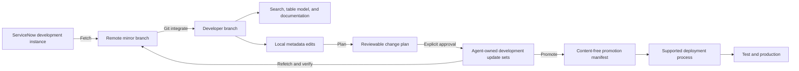

# snagentic product guide

For the formal product definition, requirements, detailed data flows, security review,
operating guidelines, governance, and enterprise adoption criteria, see the
[product handbook](product-handbook.md).

## Product summary

`snagentic` gives development teams and coding agents a safe, Git-native way to
understand, change, document, and operate ServiceNow configuration.

It mirrors a ServiceNow instance into readable files, builds a searchable model of how
the instance behaves, converts proposed file edits into reviewable ServiceNow change
plans, and applies approved changes through development update sets. It also produces
evidence-backed product and process documentation from the same mirrored source.

### The 30-second explanation

> snagentic turns a ServiceNow development instance into a structured Git workspace.
> Developers and AI coding agents can inspect the platform as code, understand
> dependencies, make reviewed changes through update sets, detect conflicts with other
> work, and generate documentation that stays linked to the real implementation. It
> never writes directly to test or production.

### The problem it solves

ServiceNow behavior is distributed across tables, scripts, policies, access controls,
flows, form configuration, update sets, and application scopes. Important relationships
are difficult to see in one place, and conventional coding agents cannot reliably reason
about an online instance from isolated XML exports or screenshots.

snagentic addresses four recurring problems:

| Problem | Product response |
|---|---|
| The implementation is fragmented across the platform | Mirror metadata and scripts into a normalized, searchable workspace |
| Changes are difficult to review before they reach the instance | Produce a deterministic create/update/delete plan before any write |
| Parallel update-set work can overlap | Show update-set activity and record-level collisions before apply |
| Business documentation becomes detached from the implementation | Link authored capabilities, processes, and guides to validated technical evidence |

## Who it is for

### ServiceNow developers and platform engineers

Use normal files, Git diffs, search, and code review to understand and change a
development instance. Scripts are stored as script files rather than buried inside XML.

### Coding agents

Start from table models, indexed metadata, source paths, and dependency references
instead of guessing from partial context. The Copilot CLI extension exposes bounded,
schema-validated tools for the supported workflows.

### Technical architects and reviewers

Trace a capability from business purpose through tables, rules, scripts, access
controls, events, properties, and update sets. Review the exact planned writes before
they are applied.

### Process owners and documentation teams

Maintain purpose, ownership, process, and user guidance as reviewed Markdown while the
generator supplies implementation facts and detects stale evidence.

### Security, risk, and operations teams

Review explicit environment boundaries, credential handling, redaction, approval gates,
dependency audits, SBOMs, signed-off documentation status, and content-free promotion
manifests.

## Product capabilities

### 1. Mirror the instance into Git

The instance mirror reads ServiceNow through supported APIs and stores configuration in
`instances/<name>/`:

- metadata records as normalized YAML;
- script and text fields as separate files;
- read-only child configuration such as flow logic, layouts, and workflow activities;
- update-set information and operational inventory;
- derived table models and generated documentation.

Remote state is committed to a dedicated `servicenow-remote/<name>` branch. Fetching
does not replace the developer's working tree. Integration uses a normal Git
three-way merge, so conflicts are visible as standard conflict markers.

### 2. Understand platform behavior

snagentic builds several views of the same implementation:

- table schemas, inheritance, fields, choices, and references;
- business rules, client scripts, UI policies, UI actions, ACLs, notifications, events,
  SLAs, assignment rules, and data policies;
- script include calls, table queries, emitted events, and property reads;
- local full-text search and dependency references;
- team activity and update-set collision reports.

The table view is the recommended starting point for analysis because it combines the
table definition with inherited and table-specific behavior and links every item back to
its mirrored source.

### 3. Plan changes before writing

Developers or agents edit only the normalized local metadata workspace. The planner then
compares those edits with the integrated mirror and produces a deterministic plan:

- records to create;
- fields or scripts to update;
- records to delete;
- expected remote hashes;
- collisions with other open update sets.

Planning is read-only. The plan identifier binds approval to the reviewed content, so a
different local state requires a new plan.

### 4. Apply approved changes safely

After explicit approval, snagentic writes the reviewed plan to agent-owned update sets on
a development instance. It verifies optimistic-concurrency hashes, records interrupted
apply state, refreshes touched records, and prevents accidental replay.

Write controls are intentionally asymmetric:

- development: supported writes with explicit confirmation;
- test: read-only;
- production: read-only.

Movement from development to test or production remains in the organization's supported
ServiceNow deployment process.

### 5. Detect team conflicts

The product mirrors open and recently changed update sets and can report:

- which applications and scopes are being changed;
- how much change is active;
- records captured in more than one open update set;
- conflicts that affect the current local plan.

Operational views may contain user identity locally. Generated, source-controlled
documentation publishes only aggregate update-set information.

### 6. Produce evidence-backed documentation

snagentic combines two types of documentation:

1. **Authored source** under `instances/<name>/documentation/` for business purpose,
   ownership, benefits, processes, policy, and user instructions.
2. **Generated output** under `instances/<name>/docs/` for technical facts, evidence
   links, diagrams, table behavior, governance status, and change-impact fingerprints.

The generator validates evidence targets against the mirror. A strict check fails when:

- generated output is stale;
- required evidence is missing or ambiguous;
- an approved document has never been reviewed;
- an approved document is overdue for review;
- the MkDocs site cannot build cleanly.

This separation prevents the generator from inventing business meaning while still
keeping technical claims traceable to the implementation.

### 7. Run platform operations

For supported administrative operations, snagentic uses ServiceNow CI/CD APIs. Examples
include plugin, application, update-set, automated-test, and scan operations.

For the small number of operations that have no supported API, the product can run
reviewed Playwright recipes. UI automation is isolated, requires a dry run and approval
for real execution, and stores screenshots and traces locally.

### 8. Prepare promotion evidence

Promotion completes the agent-owned development update sets and writes a content-free
manifest. The manifest records identifiers, hashes, and provenance without embedding
ServiceNow record payloads or credentials.

The manifest supports downstream governance, but snagentic does not import changes into
test or production.

## End-to-end product workflow

The normal lifecycle is:

1. Fetch current remote state.
2. Integrate the remote mirror into the working branch.
3. Inspect relevant tables, behavior, dependencies, activity, and collisions.
4. Edit normalized metadata files.
5. Generate and review a change plan.
6. Explicitly approve and apply the plan to development.
7. Refetch and verify the result.
8. Complete the agent update sets and create a promotion manifest.
9. Use the supported deployment process for test and production.

## What the product creates

| Location | Purpose |
|---|---|
| `instances/<name>/metadata/` | Editable, version-controlled ServiceNow metadata |
| `instances/<name>/model/` | Derived schemas, inheritance, behavior, and customer-update models |
| `instances/<name>/update-sets/` | Mirrored update-set information |
| `instances/<name>/documentation/` | Reviewed capability, process, and guide source |
| `instances/<name>/docs/` | Generated MkDocs site and technical evidence |
| `.snagentic/` | Ignored local state, indexes, diagnostics, browser evidence, and manifests |
| `servicenow-remote/<name>` | Remote-only Git mirror branch |

## Trust and safety model

### Environment protection

- Writes are denied unless the selected instance is configured as development.
- Mutating operations require explicit confirmation.
- Test and production promotion stays outside the tool.
- UI recipes use dry-run-first behavior and separate approval for execution.

### Credential protection

- Repository configuration stores environment-variable names, not credential values.
- Credentials are loaded from the environment or owner-restricted user-local files.
- Credential variable names are allowlisted.
- Shell syntax and command flags are rejected in executable overrides.
- Tool output, browser output, and diagnostics are bounded and scrubbed.

### Data protection

- Secret field types and configured sensitive fields are removed from mirrored records.
- Property values are excluded unless an exact property name is explicitly allowlisted.
- `.snagentic/` is local-only and ignored by Git.
- Generated documentation excludes user ownership fields and credential/property values.
- Promotion manifests contain identifiers and hashes, not record content.

### Change integrity

- Git provides merge history and conflict resolution.
- Canonical record hashes detect remote changes since planning.
- A reviewed plan is identified by its content-derived plan ID.
- Interrupted applies leave reconciliation state and block unsafe replay.
- CI validates formatting, typing, tests, coverage, documentation freshness, dependency
  vulnerabilities, package builds, and container behavior.

## Deployment and operating model

snagentic is a local development and automation tool, not a hosted multi-tenant service.

The supported runtime uses Docker Compose:

- `cli`: the Python command-line product;
- `test`: the Python test environment;
- `lint`: lint and strict type checking;
- `ui`: the Playwright environment for UI-only recipes.

The production image uses a non-root user. Base images and GitHub Actions are pinned,
and CI produces dependency SBOMs. A validated direct-Python override is available for
approved local environments.

The product can be used directly from its CLI or through the GitHub Copilot CLI
extension. The extension is an orchestration layer; the same safety checks are enforced
by the underlying Python commands.

## Typical use cases

### Explain an existing ServiceNow capability

1. Open the relevant table model.
2. Follow inherited and direct behavior to mirrored source files.
3. Search for called script includes, properties, events, and related tables.
4. Generate or update capability and process documentation with evidence links.

### Build a small platform feature

1. Fetch and integrate current state.
2. Review table behavior and team collisions.
3. Edit the required metadata files.
4. Review the change plan.
5. Apply to development after approval.
6. Run ServiceNow tests or scans.
7. Promote the development update sets for normal deployment.

### Review another developer's work

1. Inspect open update sets and activity.
2. Identify records present in multiple update sets.
3. Compare the proposed local files and plan with the remote mirror.
4. Resolve collisions before apply or approve them explicitly.

### Maintain process documentation

1. Author the business purpose and process in durable Markdown.
2. Reference the supporting tables, roles, events, properties, or artifacts.
3. Build the generated site.
4. Review evidence, coverage gaps, and approval dates.
5. Use `docs check --strict` in CI to prevent stale approved documentation.

## Product boundaries and limitations

snagentic deliberately does not:

- act as a transactional ServiceNow database backup;
- mirror arbitrary business records or journal content;
- store credentials or protected field values in Git;
- write changes directly to test or production;
- replace ServiceNow update sets, application repositories, or deployment governance;
- infer business purpose, policy, ownership, or benefits without human review;
- guarantee that UI automation remains compatible after every ServiceNow UI upgrade.

Additional operating considerations:

- API visibility depends on the configured ServiceNow integration user's roles and ACLs.
- Large mirrors require disk space and benefit from Git's untracked cache and filesystem
  monitor.
- Playwright recipes should be treated as a last resort when no supported API exists.
- This is a pre-1.0 product; the latest default-branch revision is the supported line.

## Why it is different

### Git-native rather than export-centric

The primary working format is readable YAML and script files with standard Git history,
not opaque XML bundles.

### ServiceNow-native writes

Changes still land in ServiceNow update sets. The product improves analysis, review, and
automation without bypassing the platform's native change mechanism.

### Agent-ready context

The product supplies coding agents with bounded tools, table models, dependency paths,
and exact source locations instead of requiring broad, speculative searches.

### Documentation tied to evidence

Business documentation and generated technical facts are separated but connected by
validated references and fingerprints. This makes documentation drift visible in CI.

### Safety before convenience

Development-only writes, explicit approval, collision checks, redaction, deterministic
plans, and refetch verification are core behavior rather than optional conventions.

## Suggested product talk track

### For an executive or product owner

> snagentic reduces the time and risk involved in understanding and changing ServiceNow.
> It makes platform configuration reviewable in Git, lets developers and AI assistants
> work from the same evidence, detects overlapping work, and keeps product documentation
> connected to the implementation. Existing ServiceNow deployment controls remain in
> place.

### For a ServiceNow platform owner

> snagentic reads the development instance into a remote Git mirror, derives table and
> dependency models, and turns local edits into collision-aware update-set plans. It
> applies only after approval and only to development. Promotion completes the update
> sets and produces a manifest for the normal deployment pipeline.

### For a security reviewer

> The tool is local and development-focused. Credentials stay outside the repository,
> sensitive fields are redacted, writes are blocked for test and production, command
> execution uses validated argument arrays, containers run with reduced privileges, and
> CI performs static analysis, dependency audits, SBOM generation, and strict tests.

### For a developer or coding-agent user

> Fetch, integrate, inspect the table model, edit the mirrored files, review the plan,
> and apply it to a development update set. The tool handles remote hashes, collisions,
> refetching, search, references, and documentation links.

## Suggested demonstration

A concise product demonstration can follow this sequence:

1. Show an instance table view for `incident`, including inherited behavior and source
   paths.
2. Search for an event, property, or script include and show its references.
3. Show open update-set activity and collision detection.
4. Make a small local script or metadata edit.
5. Generate the change plan and explain that no remote write has occurred.
6. Show the explicit development-only approval gate.
7. Open the generated capability/process documentation and its technical evidence.
8. Run the strict documentation check.
9. Show the content-free promotion manifest and explain the external deployment boundary.

## Frequently asked questions

### Is this a replacement for ServiceNow source control or update sets?

No. It provides a Git-native analysis and review workspace while using ServiceNow update
sets and supported deployment mechanisms for changes.

### Does it copy production business data into Git?

No. The product focuses on configuration metadata and selected non-sensitive operational
inventory. It excludes arbitrary business records, journal data, and protected values.

### Can it be used without GitHub Copilot CLI?

Yes. The Python CLI provides the underlying functionality. The Copilot extension exposes
the same commands as agent-friendly tools.

### Can it change production?

No. The policy layer denies writes to test and production. Deployment beyond development
uses the organization's supported ServiceNow process.

### Why is browser automation included?

Some ServiceNow operations do not have a supported API. Reviewed Playwright recipes cover
those gaps, but API operations remain preferred.

### Can generated documentation be trusted?

Technical facts are derived from the mirror and linked to exact evidence. Business
purpose and instructions still require human authorship and review. Strict checks make
missing, stale, ambiguous, unreviewed, or overdue approved content visible.

## Related documentation

- [Architecture](architecture.md)
- [Copilot CLI and tool reference](copilot-cli.md)
- [Documentation authoring](documentation-authoring.md)
- [Acceptance test plan](acceptance-test-plan.md)
- [Promotion model](promotion.md)
- [Security policy](../SECURITY.md)
- [Support policy](../SUPPORT.md)
